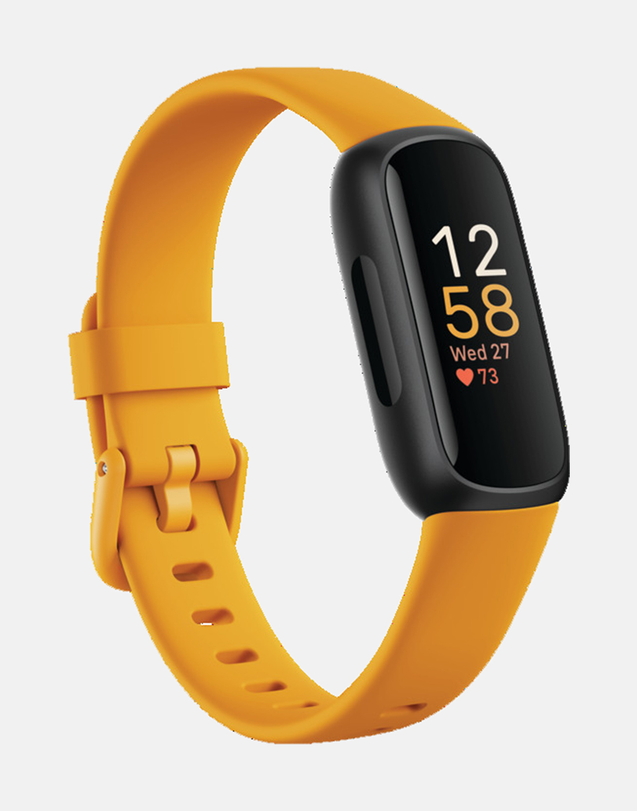

<h1 align="center">Fitbit Data Analysis</h1>

  

  

  

  

This project is intended to showcase my knowledge when learning C and using file operations. The goal of this project was to dive into Fitbit data to analyze various health metrics like calories burned, distance walked, heart rate, and sleep quality. My main objectives were to grasp and apply data cleansing techniques, implement deduplication methods, and perform data analysis to compute meaningful results. Throughout this project, I covered topics such as C language programming, arrays, strings, pointers, structs, and basic string handling functions. I learned how to parse and convert strings from files, filter datasets, and understand the differences between array and pointer notation. Additionally, I created basic test cases, computed statistical summaries, and reported results in a structured format both on the screen and in a CSV file. This assignment reinforced the importance of accurate data handling, structuring programs effectively, and ensuring data integrity through cleaning and deduplication processes.

   

Watch the Full Video Demo Here

---

# Table of Contents
- [What I Learned](#what-i-learned-in-this-project)
- [Tools Used](#tools-used-in-this-project)
- [Development Environment](#development-environment)
- [Team / Contributors / Teachers](#team--contributors--teachers)
- [How to Set Up](#how-to-set-up)
- [Project Overview](#project-overview)
- [Acknowledgments](#acknowledgments)

---

# What I Learned in this Project
- File operations like read/write from existing file to new files
- Programming conventions in C
- Data Organization/Mining techniques

# Tools Used in this Project
- Python

# Development Environment
- VS Code
- Terminal
- Windows 10

# Team / Contributors / Teachers
- [Mitchell Kolb](https://github.com/mitchellkolb)
- [name]()
- Professor. 

# How to Set Up
This project was implemented on our local machine inside of a virtual machine using:
- Ubuntu Version 20.04.03 found at this [link](http://lt.releases.ubuntu.com/20.04.3/).
- Clone this repository 
- Open terminal at the codebase `~.../ext2/Noah-Mitchell/`

# Project Overview
This project utilizes 

## Project Details

### Introduction
In this project, we apply 

### Literature Review
In this we drew inspiration from various sources, including video tutorials online for 

### Technical Plan
The project employs a 

### Implementation Details

#### Files and Structure
- `game.py`: Contains the racing game environment and controls the car's movement.
> [!NOTE]
> These files were 

### Implementation
In this project

#### Results and Observations
During development,

  
  

#### Future Work
Future improvements could include

## References

--- 
# Acknowledgments
This codebase and all supporting materials was made as apart of a course for my undergrad at WSU for CPTS XXX - XXX in the Spring of 2022. 

---
